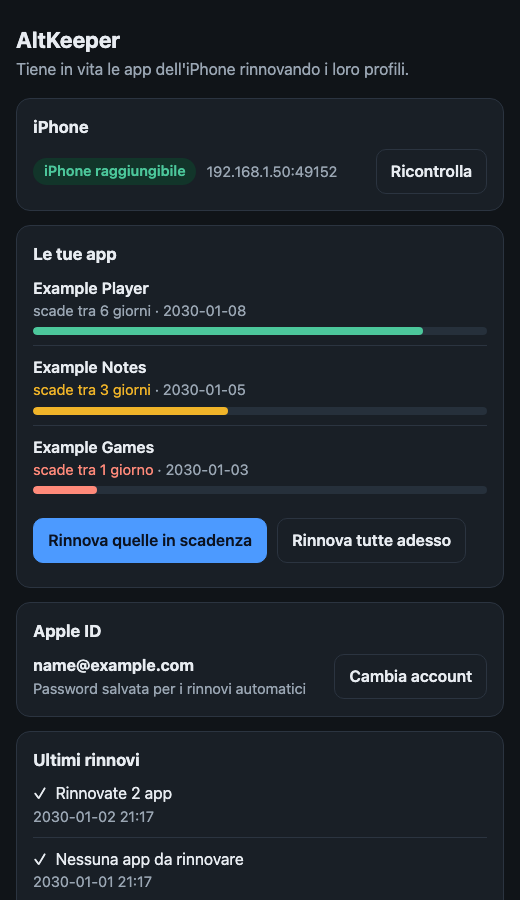

# AltKeeper

**AltServer for iOS 17+ that runs on your home server (Docker).** Refresh and install your
AltStore / SideStore-style apps over Wi-Fi, with no computer left on and no VPN.

[Italiano](README.it.md)

Keeps sideloaded iPhone apps alive. Apps installed with a **free Apple ID** stop opening after
7 days unless their *provisioning profile* is renewed. AltKeeper runs on a small always-on
machine at home and does it over Wi-Fi, with **no computer plugged in, no AltServer on a
computer and no VPN on the phone**. It can work in two ways, together or separately:

- **As AltServer for AltStore Classic**: AltStore's *Refresh All* button and installing or
  updating apps from AltStore work, with this machine answering instead of AltServer.
- **On its own**: it renews the profiles by itself every evening (cron), even if AltStore is
  never opened.

There is also a small **web page** to see the state of your apps and renew them (in Italian):



> **Status: experimental.** Tested on an iPhone 15 Pro (iOS 27.0) with AltStore Classic (the latest
> version at the time of writing), running on a Mac and, for the unattended renewal, on a Debian 13
> server (x86-64). It relies on private Apple APIs and on AltStore's own protocol, which can
> change without notice. For personal use with your own Apple ID; not affiliated with Apple or
> AltStore. Command-line messages and code comments are in Italian.
>
> Confirmed (AltServer running on a Mac): *Refresh* from AltStore installs the new profile on the
> iPhone, and installing an app (about 126 MB) from AltStore works. Confirmed earlier: sign-in,
> `apps`, `renew`, and that an app still opens with only the *newer* profiles installed (also after
> rebooting the iPhone). Not confirmed yet: what happens on the day the *original* profile
> expires, and running AltServer from the Docker image on a server for a longer time.

## What it does, and what it does not

- Renews the provisioning profiles of your apps (and, in AltServer mode, installs the apps AltStore
  sends it). It does not re-sign apps and **never creates or revokes certificates**.
- **AltServer mode does not need your Apple ID on the server.** AltStore signs in on the iPhone;
  this program only gives it anisette data and installs what AltStore sends. The unattended renewal
  (`renew`, cron, the web page's "Rinnova") does need the Apple ID and its password on the server.
- The two do not clash: `renew` looks at the newest profile on the phone. If AltStore renewed
  recently, `renew` does nothing and does not even sign in to Apple.
- Old profiles stay on the phone after a renewal (iOS does not remove them), so you will see
  several profiles per app. That is expected. In AltServer mode it never removes profiles, even
  when AltStore asks (`activeProfiles`).
- Not supported: enabling JIT (`EnableUnsignedCodeExecution`); it answers with an error.
- After an unattended `renew`, AltStore may keep showing the old expiry date: it only updates its
  own record when it does the refresh itself. The apps are fine.

## What you need

- An iPhone on **iOS 17 or later**, with Developer Mode on, on the same Wi-Fi as the server.
- A machine that is always on in your home network. Tested: Debian 13 (x86-64). A Mac works too.
- For AltServer mode: **AltStore Classic** on the iPhone, with the *Local Network* permission.
- For the unattended renewal: a **free Apple ID** whose team already signed the apps.
- For the **first pairing only**: the iPhone plugged in by USB to a computer (a Mac is easiest).
- Optional: `curl`, `jq` and the [ntfy](https://ntfy.sh) app for notifications; Docker.

## Set up

### 1. Get the program

```sh
git clone https://github.com/BartolomeoRusso9/altkeeper
cd altkeeper
docker run --rm -v "$PWD":/w -w /w rust:1-bookworm cargo build --release
```

The binary is `target/release/altkeeper`. Notes:

- On an Apple Silicon Mac, add `--platform linux/amd64` to build for an x86-64 server (slower:
  about 5 to 7 minutes).
- If you also build for the Mac in the same folder, add `-e CARGO_TARGET_DIR=/w/target-linux` so
  the two builds do not overwrite each other.
- On a Mac you can simply run `cargo build --release`.
- Or use the Docker image (see [Docker](#9-docker)).

On the server, create a folder (for example `/srv/altkeeper`) and copy there the `altkeeper`
binary and the files in `examples/` you need.

### 2. Find your iPhone (optional)

AltKeeper finds the iPhone by itself, and finds it again if its address changes (it changed
several times in a few hours in our tests). It tries, in order: the address you give, the last one
that worked (`state/phone-addr`), Bonjour (`_remotepairing._tcp`), and finally a scan of your local
network for the phone's service port (49152), which does not depend on Bonjour (on a server where
another program shares the Bonjour port, the answers can go missing). So you can skip this step. If you prefer to give the address, use `--phone ip:port` or `ALTKEEPER_PHONE=ip:port`
(the port is usually 49152). On a Mac you can look it up:

```sh
dns-sd -B _remotepairing._tcp                       # lists the instances, stop with Ctrl-C
dns-sd -L "<instance name>" _remotepairing._tcp local   # shows host and port (usually 49152)
dns-sd -G v4 <host>.local                           # shows the IP address
```

### 3. Pair (once, over USB)

`pair-usb` needs the computer's `usbmuxd` reachable over TCP. On a Mac, use the small bridge in
`examples/`:

```sh
# Terminal 1 (leave it open): exposes the Mac's usbmuxd on 127.0.0.1:27015
python3 examples/usbmux-bridge.py

# Terminal 2, with the iPhone plugged in, unlocked, and "Trust" accepted:
export USBMUXD_SOCKET_ADDRESS=127.0.0.1:27015
./target/release/altkeeper pair-usb
```

This writes `rp-pairing.plist`. Copy it next to the binary on the server and keep it private
(`chmod 600`). Copying a pairing made on a Mac to a Debian server worked in our tests. On Linux, the
same bridge idea with `socat` (`socat TCP-LISTEN:27015,bind=127.0.0.1,fork UNIX-CONNECT:/var/run/usbmuxd`)
should work, but we have not tried it.

Then check the connection, from the server folder:

```sh
./altkeeper phone        # lists the profiles installed on the phone
```

### 4. AltServer for AltStore (recommended)

```sh
./altkeeper altserver            # or: ./altkeeper serve --altserver (with the web page)
```

Leave it running (as a service or in Docker). On the iPhone, in AltStore, open **My Apps** and tap
**Refresh All**, or install an app: AltStore finds the server by itself. It listens on port
**49500** (`--port N` to change it) and announces itself with Bonjour as `_altserver._tcp`.

- Only one AltServer should be on the network: stop any AltServer on a computer, and do not run
  two copies of this program.
- Try it first with one unimportant app, not with *Refresh All* on everything.
- AltStore shows *"AltServer could not be found"* for several kinds of lost connection when the
  server is not the one it prefers, so that message can hide the real cause. Look at the server's
  output: it logs every connection, request and answer.
- The first request creates the anisette identity in `state/` if it does not exist yet. We have
  used it with an identity created by `login`; a clean folder has not been tried.

### 5. Sign in (only for the unattended renewal and the web page's renew)

```sh
./altkeeper login your.apple.id@example.com
```

It asks for your password (**it is shown on screen while you type**) and the 6-digit 2FA code from
your other devices. Answer `s` when it asks to save the password: that is what lets the renewal run
without you. It is stored **in clear text** in `account.json` (mode 600). Sign in once; if Apple
answers with errors, wait before trying again instead of repeating it.

```sh
./altkeeper apps                                # your App IDs and expiry dates
./altkeeper renew --dry-run --min-days 7        # shows what it would renew, changes nothing
./altkeeper renew --min-days 7                  # renews now what expires within 7 days
```

`renew` looks at each app's newest profile, renews the ones with `--min-days` days left or fewer
(default 3), and signs in to Apple **only if something is due**.

### 6. Automatic renewal (optional)

A safety net that does not depend on the iPhone running AltStore.

1. Copy `renew.sh` and `notifica.sh` from `examples/` next to the binary, and `chmod +x renew.sh`.
   Leave `ALTKEEPER_PHONE` unset in `renew.sh` (the phone is found by itself) or put its `IP:port`.
2. Install the cron job (edit the path first): `cp altkeeper.cron /etc/cron.d/altkeeper`

It runs every evening at 21:17, renews what is due and appends date and result to `renew.log`.
The iPhone must be on the home Wi-Fi at that time. With profiles lasting 7 days and a threshold of
3, you get several evenings of margin before an app expires.

### 7. Notifications (optional)

Create `notify.conf` next to the scripts, with a long random topic name:

```sh
echo 'NTFY_TOPIC=pick-a-long-random-name-here' > notify.conf && chmod 600 notify.conf
```

Install the ntfy app on your phone and subscribe to that topic. You get a message when apps are
renewed and when a run fails (at most one error message every 24 hours, because the phone may just
be away from home). Nothing is sent when there is nothing to renew. Anyone who knows the topic can
read it, so keep it secret.

### 8. Web page (optional)

```sh
ALTKEEPER_WEB_PIN=123456 ./altkeeper serve --bind 0.0.0.0:8787 --altserver
```

Open `http://<server>:8787` (any user name, the PIN as password). It shows whether the iPhone is
reachable and the apps with the days left, lets you renew them ("Rinnova quelle in scadenza" or "Rinnova
tutte adesso", with a live log), sign in with your Apple ID (the 2FA code is typed in the browser)
and see the latest renewals from `renew.log`. Without `--bind`, or with a loopback address, it
listens only on the machine itself and needs no PIN; on any other address it **refuses to start
without a PIN** (at least 4 characters). Use the environment variable rather than `--pin`, which is
visible in `ps`. The page is in Italian and there is no HTTPS: keep it inside your home network.
The web page's own sign-in and renew were not run against Apple yet.

### 9. Docker

```sh
docker build --platform linux/amd64 -t altkeeper:latest .
```

The image holds nothing secret: pairing, account and state live in the `/data` volume. Copy
`examples/docker-compose.yml` to `/srv/altkeeper/docker-compose.yml`, put your
`rp-pairing.plist` (and `account.json`/`state/` if you use `renew`) in the same folder, write
`ALTKEEPER_WEB_PIN=...` in `/srv/altkeeper/.env` (mode 600) and run `docker compose up -d`. It
uses the host network, because it needs Bonjour to find the iPhone and to be found by AltStore;
ports 8787 (web) and 49500 (AltServer) must be free.

A GitHub Actions workflow (`.github/workflows/docker.yml`) runs the tests and publishes the image
to `ghcr.io/<user>/altkeeper` on pushes to `main` (amd64) and on `vX.Y.Z` tags (amd64 and
arm64). It has not been run on GitHub yet. If the repository is private the package is private too.

## Commands

| Command | What it does |
| --- | --- |
| `phone [--phone ip:port]` | lists the profiles installed on the iPhone |
| `pair-usb [file]` | creates the remote pairing over USB (once) |
| `login <apple-id>` | signs in with 2FA and saves the account |
| `apps` | lists your App IDs and their expiry dates |
| `renew [--dry-run] [--force] [--min-days N] [--phone ip:port]` | renews the profiles that are due |
| `altserver [--port N] [--dir folder] [--phone ip:port]` | acts as AltServer for AltStore |
| `serve [--bind ip:port] [--pin PIN] [--dir folder] [--phone ip:port] [--altserver] [--altserver-port N]` | web page (and, with `--altserver`, AltServer) |
| `profile-remove <uuid>` | takes one profile off the phone, saving a copy in `profili-salvati/` |
| `profile-restore <file>` | puts a saved profile back |

`ALTKEEPER_PHONE=ip:port` can replace `--phone`; without either the phone is found by itself (see
step 2). `ALTKEEPER_NO_MDNS=1` turns Bonjour off (networks that block multicast, or to test the scan).
`ALTKEEPER_DEBUG=1` prints what Apple answers to each sign-in request (status, headers, error
bodies; never request bodies or successful responses).
`ALTKEEPER_ANISETTE_URL=https://...` uses your own anisette server (for example `anisette-v3-server`)
instead of the default one; it must start with `http://` or `https://`.

The project used to be called altrefresh: the old `ALTREFRESH_*` variable names still work (the
`ALTKEEPER_*` one wins if both are set). `altkeeper --version` prints the version.

## If something goes wrong

- **"manca il pairing remoto"**: there is no `rp-pairing.plist` in the folder. Pair again (step 3).
- **"pairing con l'iPhone non riuscito" / `early eof`**: the iPhone no longer recognises that
  pairing. Pair again, or copy a working `rp-pairing.plist` from another computer.
- **"non trovo l'iPhone in rete", "No route to host", timeouts**: the iPhone is not on the network
  (asleep, away). If you gave an address that is no longer right, the program looks for the phone
  by itself; if you want a fixed address, on the iPhone open Settings, Wi-Fi, the (i) of your
  network, and set the private Wi-Fi address to **Fixed** or off (the wording depends on the iOS
  version), then give the iPhone a fixed IP in your router.
- **AltStore says "AltServer could not be found"**: see step 4. Check that the server is running, on
  the same network, that AltStore has the Local Network permission, and read the server's output.
- **Sign-in errors 429 or 503**: Apple is limiting requests. Do not retry in a loop. Run with
  `ALTKEEPER_DEBUG=1` and, if it persists, open an issue with the lines starting with `[gs #`
  (they contain no secrets).
- **An app does not open after a renewal**: reinstall it with AltStore or the tool you normally
  use. If you removed a profile with `profile-remove`, put it back with `profile-restore`.

## Security

These files hold secrets. They are ignored by git and should be mode `600`:

- `rp-pairing.plist`: the pairing keys for the phone.
- `account.json`: the Apple ID and, if you chose to save it, the password **in clear text**.
- `state/`: the anisette "device" identity and the AltServer `serverID`.
- `notify.conf`: the ntfy topic.
- `profili-salvati/`: copies of profiles taken off the phone with `profile-remove`.

See also [SECURITY.md](SECURITY.md) for reporting a vulnerability privately.

Never paste your password, `account.json` or the pairing file in an issue or a chat. Do not use
`RUST_LOG=debug` on shared logs: at that level `idevice` prints the pairing keys. Keep the machine
that stores them inside your home network.

**The AltServer port (49500) has no login, exactly like the real AltServer**: anyone on your network
who speaks the protocol can ask for anisette data or send profiles and apps to the paired iPhone.
Do not expose that port outside your home network.

## How it works

1. The iPhone (iOS 17+) advertises the Bonjour service `_remotepairing._tcp`.
2. Using an existing remote pairing, the program does the *pair-verify*, asks the phone to open a
   tunnel and connects to it with TLS-PSK ([`idevice`](https://github.com/jkcoxson/idevice)).
3. Inside the tunnel it reads and installs profiles with `misagent`, and installs or removes apps
   with `installation_proxy`.
4. In AltServer mode, AltStore finds the machine through Bonjour (`_altserver._tcp`, with a `serverID`
   record) and sends JSON requests over TCP (a 32-bit little-endian length, then the JSON), one
   connection per operation: anisette data, profiles to install or remove, and the signed app.
5. For the unattended renewal, with your Apple ID ([`isideload`](https://github.com/nab138/isideload))
   it downloads new profiles for the existing App IDs.

The old Wi-Fi sync used by `netmuxd` and AltServer-Linux is rejected by recent iOS versions; remote
pairing is the channel that works.

## Notes on the copy of `isideload` in `vendor/`

`isideload` 0.3.17 has two problems with Apple's sign-in servers, so `vendor/isideload` is a
patched copy of the original (MIT, © nab138):

- **503 at sign-in.** It presents itself as `com.apple.dt.Xcode`, which Apple rejects.
  `src/anisette/remote_v3/mod.rs` now declares `com.apple.akd/1.0` (client identity
  `Mac15,7`, macOS 27.0) and the AuthKit User-Agent AltSign uses.
- **429 at the password proof.** Apple's edge lets only a couple of requests through on one
  connection and refuses the rest. Sign-in sends three in a row (URL bag, `init`, `complete`),
  so the third got a 429. AltSign avoids it with one fresh connection per request
  (`ALTAppleAPI+Authentication.swift`, notarized branch); `src/auth/grandslam.rs` now does the
  same (HTTP/1.1, no connection reuse, `Connection: close`). On macOS it also uses the system
  TLS. Which of these changes is the decisive one has not been isolated.

It also exposes a few read-only accessors of `AnisetteData`, used to answer AltStore.

## Credits and license

Built on [`idevice`](https://github.com/jkcoxson/idevice) (Jackson Coxson) and
[`isideload`](https://github.com/nab138/isideload) (nab138), both MIT-licensed. The sign-in fix
follows what [AltSign](https://github.com/rileytestut/AltSign) (Riley Testut) does, and the AltServer
messages follow [AltStore](https://github.com/altstoreio/AltStore)'s server protocol.
This project is licensed under the [MIT license](LICENSE).
